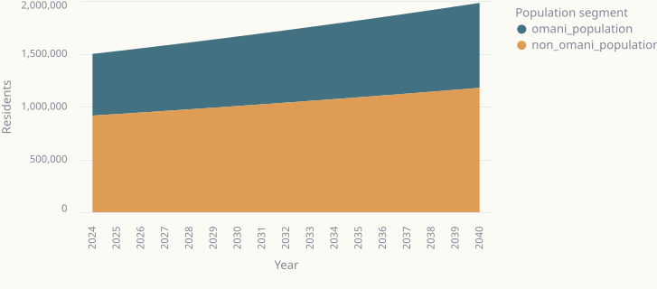
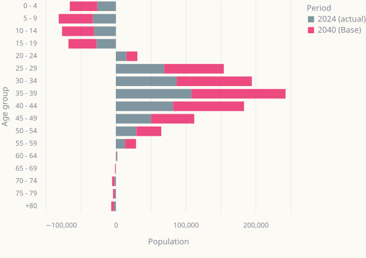
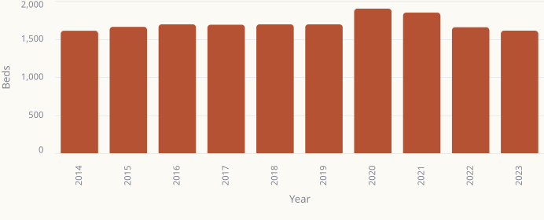
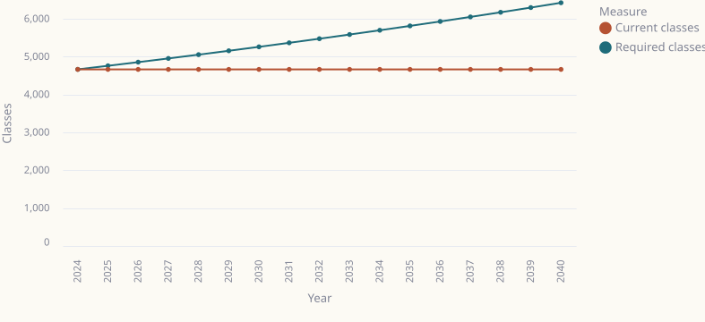
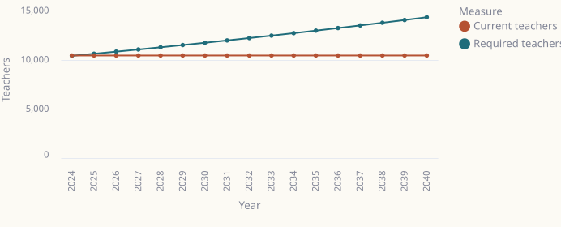

# Muscat 2040: Technical Appendix

*Author: Walid LeKheouayene*

*Full methodology, data sources, assumptions, and reproduction instructions for the Muscat 2040 growth and infrastructure model.*

---

## 1. Data sources

All data comes from the National Centre for Statistics and Information (NCSI), Oman's official statistics body. No third-party estimates or modelled data were used.

| # | File | Coverage | Publisher portal |
|---|---|---|---|
| 1 | `Muscat - Last 10 years Population cite by National Centre for Statistics and Information (NCSI).xlsx` | Muscat population by nationality (Omani / Non-Omani / Total), 2015–2024 | https://data.gov.om |
| 2 | `Muscat - Number of Beds - Hospitals cite by National Centre for Statistics and Information (NCSI).xlsx` | Muscat hospital bed count, 2014–2023 | https://data.gov.om |
| 3 | `Muscat - Healthcare Total.xlsx` | Muscat MOH hospitals, extended health centres, health centres, private clinics, pharmacies, 2014–2023 | https://data.gov.om |
| 4 | `Muscat - Education cite by National Centre for Statistics and Information (NCSI).xlsx` | Muscat students, classes, teachers, and schools by school type, 2015–2024 | https://data.gov.om |

**Publisher reference:** National Centre for Statistics and Information — https://www.ncsi.gov.om

---

## 2. Assumptions table

All default values are derived from the NCSI data series above. None are taken from external models or third-party estimates.

| Parameter | Default value | Derivation | Adjustable in model |
|---|---|---|---|
| Baseline year | 2024 | Most recent NCSI data point | No |
| Omani baseline population | 583,842 | NCSI 2024 | No |
| Non-Omani baseline population | 914,679 | NCSI 2024 | No |
| Total baseline population | 1,498,521 | NCSI 2024 | No |
| Omani annual growth — Low | 1.22% | Derived from NCSI 2015–2024 series | Yes (0.0–5.0%) |
| Omani annual growth — Base | 2.02% | Derived from NCSI 2015–2024 series | Yes (0.0–5.0%) |
| Omani annual growth — High | 2.82% | Derived from NCSI 2015–2024 series | Yes (0.0–5.0%) |
| Non-Omani annual growth — Low | 0.39% | Derived from NCSI 2015–2024 series | Yes (−1.0–6.0%) |
| Non-Omani annual growth — Base | 1.59% | Derived from NCSI 2015–2024 series | Yes (−1.0–6.0%) |
| Non-Omani annual growth — High | 2.99% | Derived from NCSI 2015–2024 series | Yes (−1.0–6.0%) |
| Hospital bed capacity (fixed) | 1,608 | NCSI 2023 (most recent) | No |
| Beds per 1,000 residents | 1.1046 | 1,608 ÷ 1,455,680 × 1,000 | Yes (0.80–2.50) |
| Gov-student share of Omani pop. | 26.3837% | 154,039 ÷ 583,842 | Yes (18.0–32.0%) |
| Students per class | 33.0131 | 154,039 ÷ 4,666 | Yes (24.0–40.0) |
| Students per teacher | 14.7589 | 154,039 ÷ 10,437 | Yes (10.0–20.0) |
| Class capacity (fixed) | 4,666 | NCSI 2024 | No |
| Teacher capacity (fixed) | 10,437 | NCSI 2024 | No |

**Important constraint:** Infrastructure capacity is held fixed throughout the model. This tests whether the current asset base is sufficient through 2040 — it does not project or assume future construction. Any planned capacity additions would need to be modelled separately.

---

## 3. Population model

### Method

The model projects Omani and non-Omani residents separately using compound annual growth from the 2024 baseline:

```
Population_t = Population_(t-1) × (1 + r)
```

where `r` is the annual growth rate for that segment and scenario, and `t` runs from 2025 to 2040.

### Why separate projections?

The two groups grow for different reasons. The Omani population grows mainly through natural births and deaths. It remained relatively steady at 1.2% to 2.8% annually between 2015 and 2024. The non-Omani population, however, depends on labour migration, which changes based on the economy and government policy. Between 2019 and 2020, the non-Omani population in Muscat dropped by 17% (from 861,398 to 716,896) due to COVID-19, not because of a demographic decline among Omanis. We have to separate the two groups so we can see this volatility.

### Observed NCSI population data (Muscat, 2015–2024)

| Year | Omani | Non-Omani | Total |
|---:|---:|---:|---:|
| 2015 | 487,592 | 793,640 | 1,281,232 |
| 2016 | 512,039 | 929,583 | 1,441,622 |
| 2017 | 528,327 | 930,922 | 1,459,249 |
| 2018 | 543,930 | 910,588 | 1,454,518 |
| 2019 | 560,011 | 861,398 | 1,421,409 |
| 2020 | 543,293 | 716,896 | 1,260,189 |
| 2021 | 553,536 | 756,645 | 1,310,181 |
| 2022 | 563,724 | 837,732 | 1,401,456 |
| 2023 | 575,171 | 880,509 | 1,455,680 |
| 2024 | 583,842 | 914,679 | 1,498,521 |

### Scenario growth rates

| Scenario | Omani annual growth | Non-Omani annual growth | Interpretation |
|---|---:|---:|---|
| Low | 1.22% | 0.39% | Slower migration recovery; softer natural household growth |
| Base | 2.02% | 1.59% | Continuation of observed Muscat trends |
| High | 2.82% | 2.99% | Faster inward migration and stronger urban concentration |

We based these planning assumptions on observed trends rather than complex econometric forecasts. The interactive model explicitly labels them as assumptions.

### 2040 population projections

| Scenario | Omani | Non-Omani | Total | Change from 2024 |
|---|---:|---:|---:|---:|
| Low | 708,854 | 973,455 | 1,682,309 | +183,788 (+12%) |
| Base | 804,008 | 1,177,292 | 1,981,300 | +482,779 (+32%) |
| High | 911,039 | 1,465,513 | 2,376,552 | +878,031 (+59%) |


*Fig. 4 — Population composition under the base scenario (source: Muscat 2040 interactive model, Tab 1 → second chart)*

### Demographic profile and age structure

The model incorporates granular age-group data to provide a deeper understanding of Muscat's demographic composition beyond topline growth:

- **Broad age bands:** Population is categorized into Youth (0-14), Working-age (15-64), and Elderly (65+) segments.
- **Dependency ratio:** Calculated as `(Youth + Elderly) / Working-age`. Muscat's large expatriate workforce results in a low dependency ratio (~0.38), indicating a favorable workforce balance.
- **Estimated median age:** Continuously estimated using age-group midpoints, highlighting the young demographic profile of the governorate.
- **Age-cohort growth:** Tracks year-over-year growth across 5-year age cohorts to identify structural shifts.
- **Planning-relevant segments:** The model independently projects specific age segments, such as the school-age population (5-19) for education infrastructure demand, and the elderly population (65+) for future geriatric healthcare and pension system pressure.


*Fig. 5 — Demographic age structure evolution (source: Muscat 2040 interactive model, Tab 2)*

---

## 4. Healthcare demand model

### Capacity baseline

1,608 beds (NCSI 2023, most recent available). This is held fixed throughout the model.

### Service ratio

1.1046 beds per 1,000 residents, derived from the 2023 NCSI observation:

```
beds_per_1000 = 1,608 ÷ 1,455,680 × 1,000 = 1.1046
```

You can adjust this between 0.80 and 2.50 per 1,000 in the interactive model. Oman's national planning target is roughly 2.0 per 1,000, while WHO guidance for comparable settings is 2.5 to 3.0.

### Formulas

```
Required beds  = projected total population × beds_per_1000 ÷ 1,000
Bed gap        = required beds − 1,608
Breach year    = first year in which bed gap > 0.5
```

Demand scales with **total population** (Omani + non-Omani), since all residents use healthcare services.

### Results

| Scenario | 2040 Population | Required Beds | Capacity | Gap | Breach Year |
|---|---:|---:|---:|---:|---:|
| Low | 1,682,309 | 1,859 | 1,608 | +251 | 2024 |
| Base | 1,981,300 | 2,189 | 1,608 | +581 | 2024 |
| High | 2,376,552 | 2,626 | 1,608 | +1,018 | 2024 |

The capacity breach year happens in 2024 for all three scenarios. We applied the 2023 ratio (1.1046 per 1,000) to the 2024 population (1,498,521), which had already grown past the 2023 numbers. This shows a real, existing gap between the population and available beds, rather than a mistake in the model.

### Historical bed data (NCSI, Muscat, 2014–2023)

| Year | 2014 | 2015 | 2016 | 2017 | 2018 | 2019 | 2020 | 2021 | 2022 | 2023 |
|---|---:|---:|---:|---:|---:|---:|---:|---:|---:|---:|
| Beds | 1,607 | 1,658 | 1,691 | 1,686 | 1,691 | 1,691 | 1,897 | 1,845 | 1,653 | 1,608 |


*Fig. 5 — Muscat hospital bed counts 2014–2023 (source: Muscat 2040 interactive model, Tab 2 → second chart)*

### Facility context (2023)

| Facility type | Count (2023) |
|---|---:|
| MOH hospitals | 6 |
| MOH extended health centres | 4 |
| MOH health centres (without beds) | 31 |
| Private sector clinics | 876 |
| Private pharmacies | 392 |

Bed counts in this model cover MOH hospital beds only; private hospital beds are not included in the NCSI series used.

---

## 5. Education demand model

### Scope

Government schools only. Non-Omani residents usually attend private or international schools. In 2024, 44,224 students went to private schools and 39,206 to international schools, compared to 154,039 in government schools. Linking government-school demand directly to the Omani population is the simplest, most defensible choice given the data we have.

### Capacity baseline (2024 NCSI)

| Indicator | 2024 value |
|---|---:|
| Students | 154,039 |
| Classes | 4,666 |
| Teachers | 10,437 |
| Schools | 185 |

### Derived service ratios (2024)

```
Gov-student share  = 154,039 ÷ 583,842 = 26.3837%
Students per class = 154,039 ÷ 4,666   = 33.0131
Students per teacher = 154,039 ÷ 10,437 = 14.7589
```

These are the default values loaded in the interactive model and can be adjusted via the sidebar.

### Formulas

```
Projected gov students = projected Omani population × gov_student_share
Required classes       = projected gov students ÷ students_per_class
Required teachers      = projected gov students ÷ students_per_teacher
Class gap              = required classes − 4,666
Teacher gap            = required teachers − 10,437
Breach year (classes)  = first year in which class gap > 0.5
Breach year (teachers) = first year in which teacher gap > 0.5
```

### 2040 results

| Scenario | 2040 Omani Pop | Proj. Gov Students | Req. Classes | Class Gap | Req. Teachers | Teacher Gap | Breach Year |
|---|---:|---:|---:|---:|---:|---:|---:|
| Low | 708,854 | 187,059 | 5,665 | +999 | 12,672 | +2,235 | 2025 |
| Base | 804,008 | 212,092 | 6,426 | +1,760 | 14,373 | +3,936 | 2025 |
| High | 911,039 | 240,355 | 7,281 | +2,615 | 16,287 | +5,850 | 2025 |

All three scenarios breach class and teacher capacity in 2025, the first full forecast year. This happens because the Omani population continues to grow from a baseline that is already completely full.


*Fig. 6 — Government school class demand vs. current capacity of 4,666 classes (source: Muscat 2040 interactive model, Tab 3 → first chart)*


*Fig. 7 — Government school teacher demand vs. current capacity of 10,437 teachers (source: Muscat 2040 interactive model, Tab 3 → second chart)*

### Historical education data (government schools, NCSI, Muscat, 2015–2024)

| Year | Students | Classes | Teachers | Schools |
|---:|---:|---:|---:|---:|
| 2015 | 94,249 | 3,168 | 8,330 | 153 |
| 2016 | 100,036 | 3,590 | 8,528 | 160 |
| 2017 | 104,153 | 3,310 | 8,620 | 169 |
| 2018 | 109,025 | 3,450 | 8,872 | 171 |
| 2019 | 115,030 | 3,620 | 9,112 | 173 |
| 2020 | 126,485 | 4,016 | 9,260 | 176 |
| 2021 | 130,432 | 4,187 | 9,547 | 179 |
| 2022 | 136,337 | 4,333 | 9,709 | 185 |
| 2023 | 142,658 | 4,453 | 10,120 | 186 |
| 2024 | 154,039 | 4,666 | 10,437 | 185 |

---

## 6. How to reproduce the model

### Requirements

```
streamlit >= 1.55, < 2
pandas    >= 2.3,  < 3
altair    >= 6,    < 7
Python    3.10+
```

Install dependencies:

```bash
pip install -r requirements.txt
```

Or individually:

```bash
py -3 -m pip install streamlit pandas altair
```

### Running the app

1. Place all four `.xlsx` data files in the same directory as `streamlit_app.py`.
2. Run:

```bash
py -3 -m streamlit run streamlit_app.py
```

3. The app opens at `http://localhost:8501`.

### Adjustable parameters (sidebar)

| Parameter | Range | Default (Base scenario) |
|---|---|---|
| Omani annual growth | 0.0–5.0% | 2.02% |
| Non-Omani annual growth | −1.0–6.0% | 1.59% |
| Beds per 1,000 | 0.80–2.50 | 1.10 |
| Gov student share | 18.0–32.0% | 26.38% |
| Students per class | 24.0–40.0 | 33.0 |
| Students per teacher | 10.0–20.0 | 14.8 |

Click **Reset** in the sidebar to return service assumptions to the 2024 observed values.

### Data refresh

The model reads the four `.xlsx` files at startup without caching them to disk. To update the model with new NCSI data, replace the relevant `.xlsx` file and restart the app. No code changes are required unless the NCSI file structure changes.

### Excel parsing note

The app parses `.xlsx` files using Python's standard library (`zipfile` + `xml.etree.ElementTree`). There is no dependency on `openpyxl` or similar packages.
